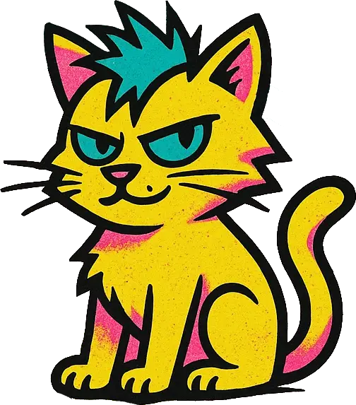

<div style="display: flex; align-items: center; gap: 2rem; margin-bottom: 2rem;">
  <div>
    
  </div>
  <div style="flex: 1;">
    <h1 style="margin: 0 0 0.5rem 0;">🐾 Moumousse Pet Sitting 🐾</h1>
    <p style="margin: 0 0 0.5rem 0; font-weight: bold;">Garde d'animaux de compagnie à domicile par Steffie</p>
    <p style="margin: 0; font-style: italic;">Faites garder vos animaux en bonne compagnie à Pélussin et alentours</p>
  </div>
</div>

---

[](https://app.netlify.com/projects/moumousse-pet-sitting/deploys)

## 📋 À propos

**Moumousse Pet Sitting** est le site web officiel du service de garde d'animaux professionnel de Steffie Thollot, situé à Pélussin (42) et ses alentours. Le site présente les services de garde à domicile, promenades canines et soins pour chiens, chats et NAC (Nouveaux Animaux de Compagnie).

### ✨ Services proposés

- 🏠 **Garde à domicile** - Visites quotidiennes pour vos animaux
- 🚶‍♀️ **Promenades canines** - Sorties régulières pour vos chiens
- 🎾 **Jeux et divertissement** - Activités adaptées à chaque animal
- 💉 **Soins médicaux** - Administration de médicaments si nécessaire
- 📸 **Photos et nouvelles** - Suivi régulier avec photos de vos compagnons

---

## 🎨 Design & Style

Le site utilise un design moderne et coloré avec :

- **Palette de couleurs vibrantes** : Teal, Yellow, Purple, Pink
- **Style brutalist** : Bordures noires épaisses et ombres portées

---

## 🛠️ Stack technique

**[Astro](https://astro.build)** • **[Tailwind CSS 4](https://tailwindcss.com)** • **[TypeScript](https://www.typescriptlang.org/)**

---

## 🚀 Quick start

```bash
npm install
npm run dev      # http://localhost:4321
npm run build    # Production build
```

---

## 🎯 Fonctionnalités

- **SEO** : Structured Data (Schema.org), sitemap auto, meta tags optimisés
- **Performance** : Site statique, images optimisées avec Sharp
- **Sections** : Hero, À propos, Services, Galerie, FAQ, Contact
- **Pages** : CGV, Carte de visite, Flyer

---

## 🎨 Configuration

- **Couleurs** : `src/styles/global.css` (Teal, Yellow, Purple, Pink)
- **Config site** : `src/config/SiteConfig.ts` (contact, SEO, Calendly)

## 🌐 Déploiement

Déployé sur **Netlify** (auto-deploy sur `master`). Aucune variable d'environnement requise.

<div align="center">

**Moumousse Pet Sitting** - _Garde d'animaux professionnelle à Pélussin (42)_

[🌐 Site web](https://moumousse-pet-sitting.fr) • [📧 Contact](mailto:contact@moumousse-pet-sitting.fr)

</div>
